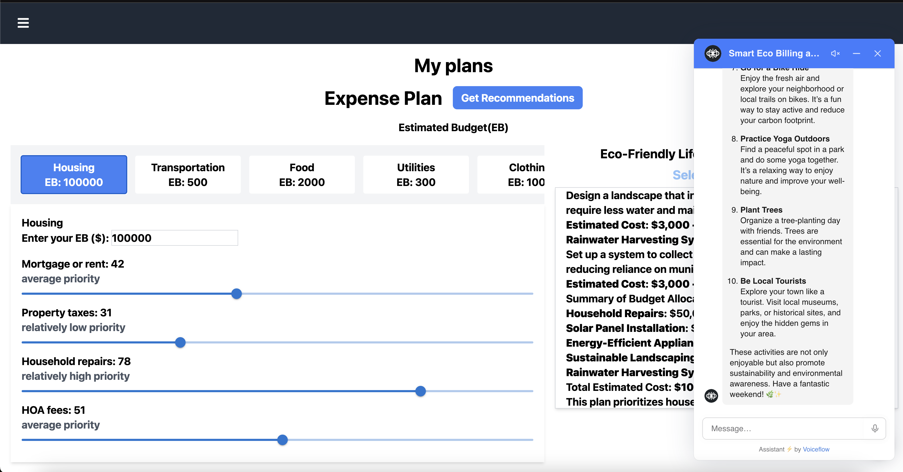

# EcoLife



EcoLife is an application that provides users with eco-friendly activity suggestions based on their estimated budget in various categories and subcategories. It also features an AI chat widget that allows users to communicate directly with an AI assistant for personalized advice on living an eco-friendly lifestyle.

## Features
- View eco-friendly activity suggestions tailored to your budget.
- Budget estimation for various categories and subcategories.
- Integrated **Voiceflow** AI chat widget for real-time interaction and advice.

## Getting Started

To get started with **EcoLife** locally, follow the instructions below.

### Prerequisites

- [Node.js](https://nodejs.org/en/) (Ensure you have Node.js installed on your machine)
- [Git](https://git-scm.com/)

### Installation

1. **Clone the Repository**

   First, clone the repository to your local machine:

   ```bash
   git clone https://github.com/Luncy-May/EcoLife.git
   cd EcoLife
   ```

2. **Set Up the Client**

   Navigate to the `client` directory and install the required dependencies:

   ```bash
   cd client
   npm install @mui/material @emotion/react @emotion/styled react-markdown
   ```

3. **Set Up the Server**

   Next, navigate back to the root of the project, and then into the `server` directory to install the server dependencies:

   ```bash
   cd ..
   cd server
   npm install cors express dotenv axios
   ```

### Running the Application

To run the project locally, you'll need to open **two terminals** — one for the client and one for the server.

#### Terminal 1: Start the Client

1. Navigate to the `client` directory:

   ```bash
   cd client
   ```

2. Run the client using:

   ```bash
   npm run dev
   ```

This will start the React development server on the client side.

#### Terminal 2: Start the Server

1. Navigate to the `server` directory:

   ```bash
   cd server
   ```

2. Run the server using:

   ```bash
   node index.js
   ```

This will start the backend server for EcoLife.

### Project Structure

```
EcoLife/
├── client/           # React frontend
│   ├── src/          # Source files for the client
│   ├── public/       # Public files (HTML, images, etc.)
│   └── package.json  # Client dependencies
├── server/           # Express server
│   ├── index.js      # Entry point for the backend
│   ├── .env          # Environment variables
│   └── package.json  # Server dependencies
├── README.md         # Project README
```

### Usage

Once both the client and server are running, open your browser and navigate to (default 5173):

```
http://localhost:5173
```

You can now start exploring eco-friendly activities based on your budget, or interact with the AI chat widget for personalized suggestions.

### Contributing

Contributions are welcome! If you'd like to contribute to the project, please fork the repository and submit a pull request.

### License

[MIT License](LICENSE)
